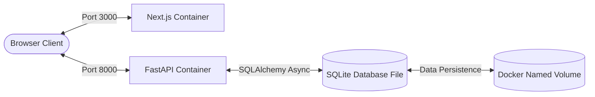
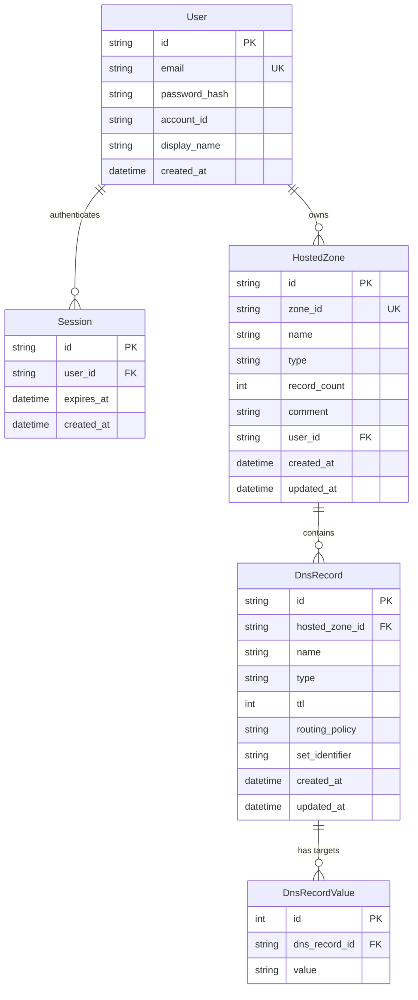

# ☁️ AWS Route 53 Console Clone

A containerized, highly responsive clone of the AWS Route 53 web console. This project recreates the authentic AWS user experience (including the signature *Squid Ink* navigation, layout accents, and dashboard workflows) backed by a high-performance FastAPI async API and a normalized, index-optimized database.

---

## 🏗️ System Architecture

The application is structured into decoupled frontend and backend services containerized with **Docker** and orchestrated using **Docker Compose**:



---

## 🗄️ Database Design & ER Diagram

The database uses a fully normalized schema designed to balance query speed, structural integrity, and consistency. 

Below is the entity-relationship layout:



### Schema Highlights & Optimizations:

1. **Normalized Record Values**: Instead of storing target IPs or servers as a single JSON array inside a string column, values are normalized into the `dns_record_values` table. This allows fast searches, deletes, and edits on individual target strings without parsing JSON data in Python memory.
2. **Indexed Lookups**: 
   * A composite index on `dns_records(name, type)` speeds up DNS resolution lookups.
   * Foreign keys like `hosted_zone_id` and `user_id` are fully indexed to avoid table scans when loading dashboards or hosted zone listings.
3. **Eager relationship fetching**: Configured with `lazy="selectin"` to leverage SQLAlchemy async engines efficiently, preventing `MissingGreenlet` errors.
4. **AWS Compatibility**: Keeps the public `zone_id` using the Route 53 format (`Z` followed by 20 uppercase alphanumeric characters) while referencing internal entities through UUID keys.

---

## ⚡ Core Features

* **Authentic AWS UI**: Recreates the AWS console visual design, including responsive sidebars, breadcrumbs, modal dialogs, and a theme switcher (Dark Mode) saved in `localStorage`.
* **Hosted Zones CRUD**: Create, read, update, and delete zones. Auto-generates matching NS and SOA records on creation.
* **DNS Record Sets**: Create and manage `A`, `AAAA`, `CNAME`, `TXT`, `MX`, `NS`, `PTR`, `SRV`, `CAA`, and `SOA` records.
* **Routing Policies**: Fully supports policy tagging (`Simple`, `Weighted`, `Latency`, `Failover`, `Geolocation`, `Multivalue`).
* **Import & Export**: Dump or import zone records in JSON format (excluding protected zone NS/SOA records).
* **Automatic Database Seeding**: Starts with pre-configured mock data for `google.com` and `scaler.ai` domains.

---

## 🚀 Getting Started

### Option A: Running with Docker (Recommended)

Make sure you have [Docker Desktop](https://www.docker.com/products/docker-desktop/) installed.

1. **Clone the repository and spin up the services**:
   ```bash
   docker compose up --build
   ```
2. **Observe Seeding**: The backend container automatically detects if the SQLite database volume is empty and seeds it using `sample.py`.
3. **Open the App**:
   * **Console Dashboard**: [http://localhost:3000](http://localhost:3000)
   * **API Swagger Docs**: [http://localhost:8000/docs](http://localhost:8000/docs)

* **Demo Credentials**:
  * **Email**: `admin@example.com`
  * **Password**: `admin`

---

### Option B: Local Non-Docker Development

#### 1. Backend Setup
```bash
cd backend
python -m venv venv

# Activate Virtual Environment:
# On Windows:
venv\Scripts\activate
# On Linux/macOS:
source venv/bin/activate

pip install -r requirements.txt

# Run migrations and seed data
python sample.py

# Start FastAPI server
uvicorn main:app --reload --port 8000
```

#### 2. Frontend Setup
```bash
cd frontend
npm install
npm run dev
```
The console will load on [http://localhost:3000](http://localhost:3000), forwarding backend requests to `http://localhost:8000`.

---

## 📡 API Endpoints Summary

### Auth
* `POST /api/auth/login` - Create session cookie.
* `POST /api/auth/logout` - Clear session.
* `GET /api/auth/me` - Get current authenticated user profile.

### Hosted Zones
* `GET /api/hosted-zones` - List zones (paginated, searchable).
* `POST /api/hosted-zones` - Create new zone.
* `GET /api/hosted-zones/{zone_id}` - Get zone metadata.
* `PUT /api/hosted-zones/{zone_id}` - Update zone comment.
* `DELETE /api/hosted-zones/{zone_id}` - Remove zone and all associated records.

### DNS Records
* `GET /api/hosted-zones/{zone_id}/records` - List zone records (paginated, searchable, type-filterable).
* `POST /api/hosted-zones/{zone_id}/records` - Create a new DNS record.
* `GET /api/hosted-zones/{zone_id}/records/{record_id}` - Read record details.
* `PUT /api/hosted-zones/{zone_id}/records/{record_id}` - Update record values or TTL.
* `DELETE /api/hosted-zones/{zone_id}/records/{record_id}` - Remove DNS record.
